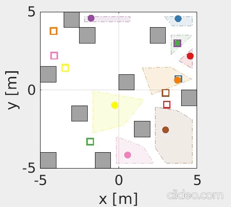

# Decentralized Probabilistic Multi-Robot Collision Avoidance Using Buffered Uncertainty-Aware Voronoi Cells


[](https://youtu.be/5F3fjjgwCSs)

This repository contains the code for the paper:

**<a href="https://arxiv.org/abs/2201.04012">Decentralized Probabilistic Multi-Robot Collision Avoidance Using Buffered Uncertainty-Aware Voronoi Cells</a>**
<br>
<a href="https://scholar.google.com/citations?user=8LVgpw0AAAAJ&hl=en">Hai Zhu</a>, 
Bruno Brito, Javier Alonso-Mora
<br>
published in **Autonomous Robots**. You can find the full-text paper <a href="https://arxiv.org/abs/2201.04012">here</a>. 

If you find this code useful in your research then please cite:
```
@article{Zhu2022AURO,
    title = {{Decentralized Probabilistic Multi-Robot Collision Avoidance Using Buffered Uncertainty-Aware Voronoi Cells}},
    author = {Zhu, Hai and Brito, Bruno and Alonso-Mora, Javier},
    journal = {Autonomous Robots},
    publisher = {Springer},
    year = {2022}
}
```

## Installation instructions
The code has been tested in Ubuntu 18.04 with MATLAB R2019b. 

## Running simulations
* Open a MATLAB instance, and run ```setPath.m``` to add necessary paths. 
* Single-integrator robots: ```run_si.m```
* Differential-drive robots: ```run_dd.m```
